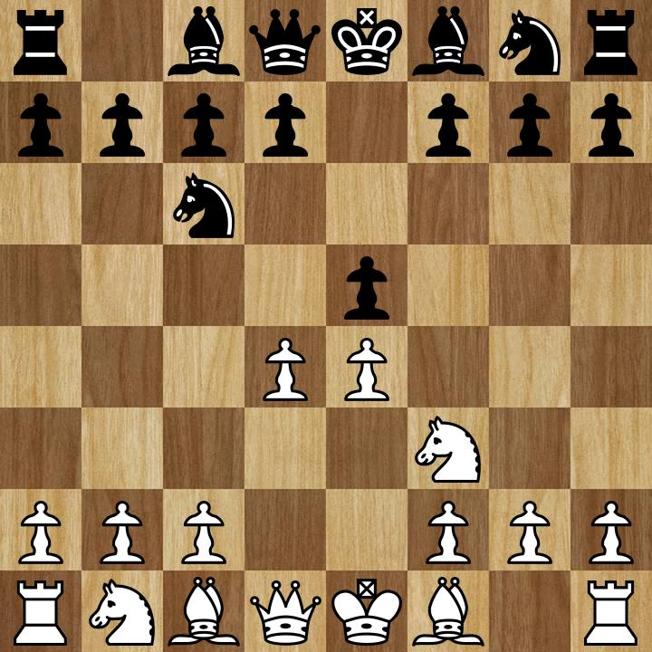
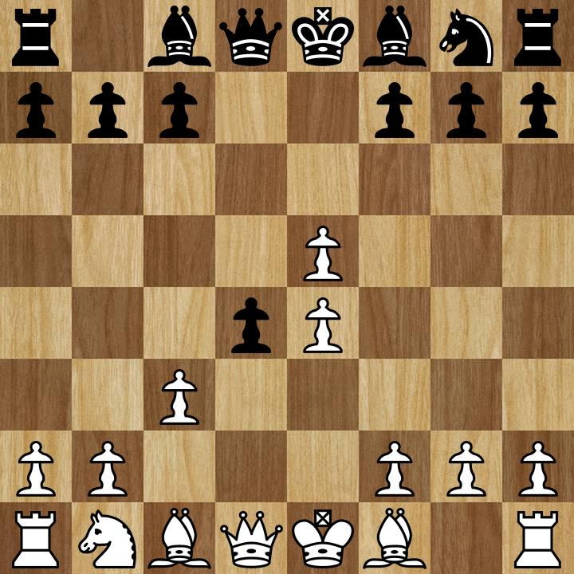
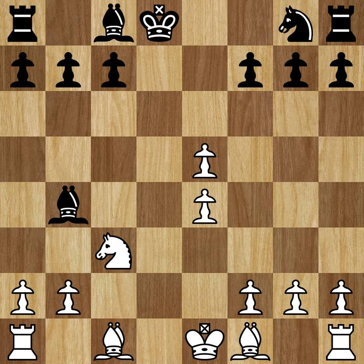
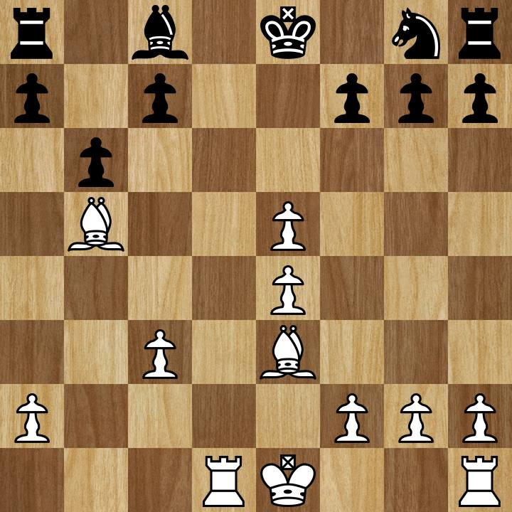
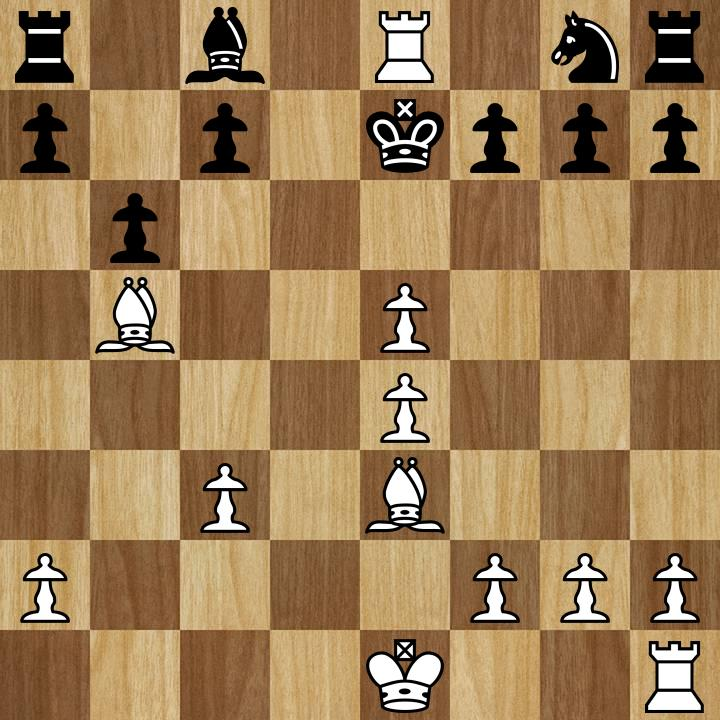

+++
title = "Chess Analysis #00: A Quick Drink of Scotch"
date =  2021-02-07
+++

A couple months ago I was browsing YouTube and stumbled across a recording of a
Twitch + Chess.com [Pogchamps][pogchamps] chess match
[between Twitch streamers @Hafu and @Fintan Hand][pogchampsVideo]. After
unexpectedly watching that video in it's entirety (prior to this point I did not
consider chess a spectator sport), I was surprised to find myself re-motivated to
play chess. I had played chess as a kid, going to after-school classes and
enrolling in tournaments and at the time I was probably good enough to hold my own
against a random person off the street, but was by no means competitive on say,
a state-wide stage.

Since then I've immersed myself back into chess, spending many of my evenings
and weekends watching, studying, and playing chess. Fast forward to today, and
I thought it might be both beneficial and fun for me to blog analyses of some of
my games, both to help improve my own gameplay, but also perhaps to revive this
blog.

<!-- more -->

This first game to analyze I found fitting for a number of reasons - it is the
first game I've managed to commit to memory, it is a relatively easy game for
me to analyze, and it was a nice checkmate (currently I consider anything that's
not a ladder mate, backrank mate, or an "overkill mate" a nice checkmate).

The game starts as a Scotch game after 1. e4 e5 2. Nf3 Nc6 3. d4. Here common
lines are 3...exd4 4. Nxd4 with any number of variations thereafter, or
4. Bc4 to enter the Scotch Gambit.

From here my opponent played 3...d5?!, the first time I've encountered this move,
though that's not saying much at this point - I would see this move again a
couple games later. Generally when the opponent leaves the d4 pawn alone and
doesn't bother defending their e5 pawn futher (another move I've seen that would
lead to this situation is 3...Nf6?!), White will play 4. Nxe5, daring Black's
knight at c6 to take back - contrast with dxe5, which makes no such dare.

Calculating further, I figured 4. Nxe5 Nxe5 5. dxe5 dxe4, I could go 6. Qxd8
forcing Black 6...Kxd8 and losing castling rights. From here I would have
the initiative perhaps with 7. Nc3 and if 7... e3 then 8. Bxe3. Black cannot
similarly attack my e5 pawn as the usual Nc6 is gone, and the usual Nf6 to
defend e4 (usually attacking e4!) is blocked by the e5 pawn. Interestingly
the engine prefers developing the bishop at this stage with 7. Be3 or Bc4 or Bf4,
but has no complaints about 7. Nc3.

Instead, after 5. dxe5 my opponent played 5...d4?, perhaps wanting to avoid
my plan of removing his castling rights. Here I had a couple of options - at
the time I thought of just developing my pieces, perhaps with the forementioned
engine-suggested bishop development moves of Bc4 or Bf4. The natural Nc3
is guarded by the d4 pawn, and Nd2 would block vision of my queen as well as
block in the queenside bishop. Ultimately I decided to go for 6. c3, challenging
the d4 pawn once more with the same plan of 6...dxc3 7. Qxd8 Kxd8. I could then
take back with 8. Nc3, simultaneously getting rid of the pawn and developing
my knight. If 6...d3,  then the pawn moves into my bishop's sights and I can
follow up with 7. Bxd3, developing the bishop and protecting e4.

To my surprise the engine, while having no qualms with 6. c3, actually prefers
6. Nd2, seemingly to develop the knight, as well as f4 or Bd3. 6. c3 suffers
from the problem of being defendable by 6...Bc5, developing Black's bishop
while defending d4 and Black is back in the game. From here it would be
hard for me to put additional pressure on d4 since there isn't the usual Nf3,
and Be3 is guarded. After 6...Bc5 White's options are to develop normally.

But my opponent went for it with 6...dxc3 and I executed my planned queen trade
and took back with my knight. Here I was pretty comfortable being a pawn up,
two pawns in the center, and a knight developed, versus their vulnerable king
and pieces sleeping in their original positions.

My opponent decided to respond with 8...Bb4, trying to take the initiative,
developing a piece and pinning my knight. My guess would be their plan was to then
launch an attack on my doubled pawns in the center, as their move in a bit
seems to confirm.

I wasn't too worried about this pin as I was already planning to castle queenside,
bringing my rook onto the open d-file as is common in Scotch games and now also
removing the pin. I was also, being a pawn up, happy if they chose to trade their
bishop for my knight, as bishops are often considered more useful going into
the endgame. Thus, 9. Be3, developing my bishop and preparing for long castle.
I chose Be3 instead of Bf4 to keep my bishop on open diagonals - I wasn't too
fussed about protecting my e5 pawn as there wasn't much that could attack it at
this point.

To my surprise my opponent followed up with 9...Bxc3 - I personally would have
looked at more development with Bd6, Be6, Ne7, which the engine also prefers.
I of course followed with 10. bxc3, thus revealing perhaps my opponent's
intention to ruin my queenside pawn structure and making me not want to castle
long anymore.

10...b6, an interesting move, what I thought at the time was to fianchetto the
bishop and attack the e4 pawn, but easily met with f3 or Bd3. Turns out the engine
likes it, perhaps because it also serves as a prophylactic to an annoying Bc5.

11. Rd1+, developing the rook and gaining a tempo on the exposed king. 11...Ke8,
a natural move but the less intuitive 11...Ke7 would've been better, for reasons
we are about to see. 12. Bb5+!, developing the bishop and gaining another tempo!

And here we see, if 11...Ke7, no such check would be possible and my opponent
would be able to try to stabilize. 12...Bd7 is not possible here because
13. Bxd7, protected by the rook. Here the king must slide to e7 anyways but my
opponent makes a fatal mistake, 12...Kf8 and a nice mating net arises and it's
lights out. 13. Rd8 Ke7 14. Re8#, protected by the bishop on b5.

The king cannot escape out the side doors as the e5 pawn from the fifth move stands
in his way.

Full PGN for the game available [here][/chess/00.pgn].

[pogchamps]: https://www.chess.com/article/view/next-pogchamps-all-the-information
[pogchampsVideo]: https://youtu.be/xJ55oA_nC7k
