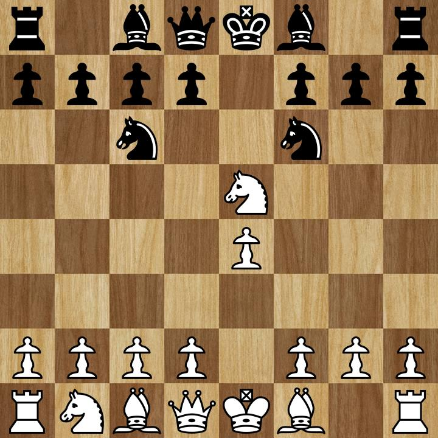
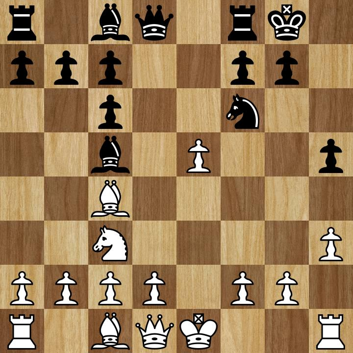
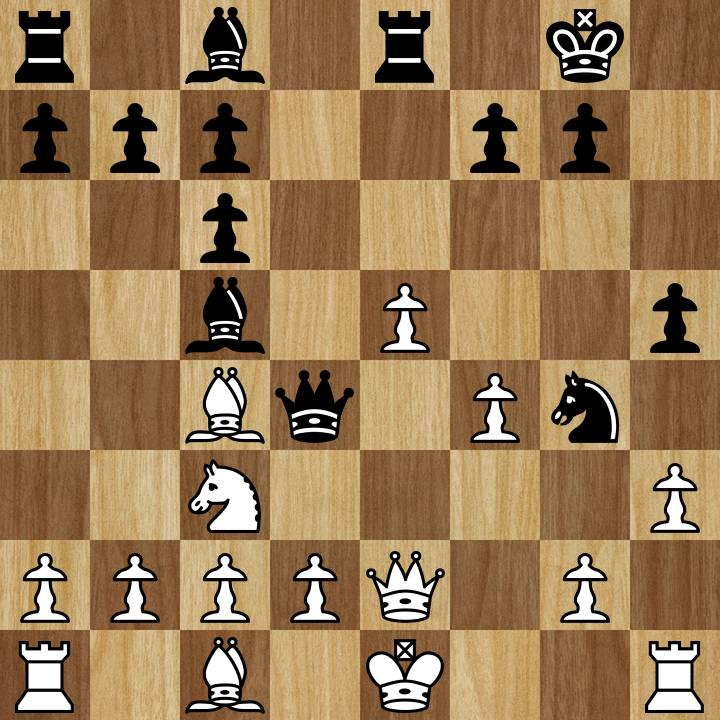
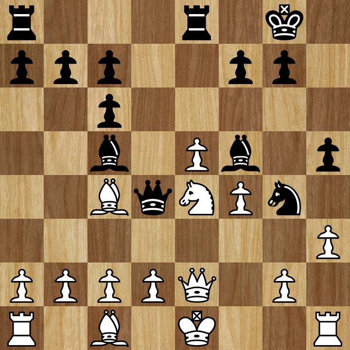
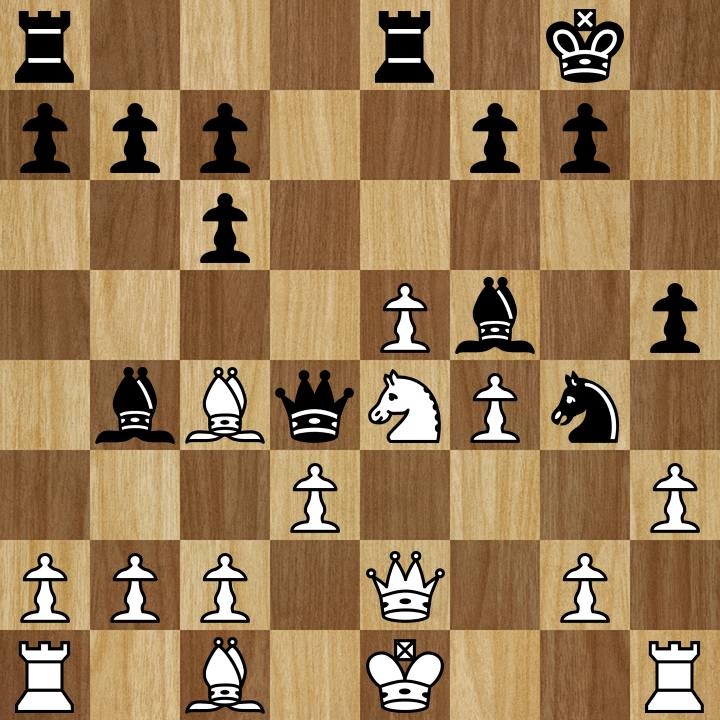
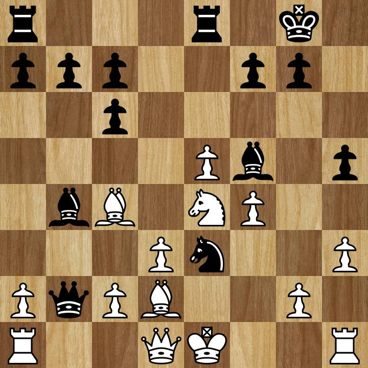
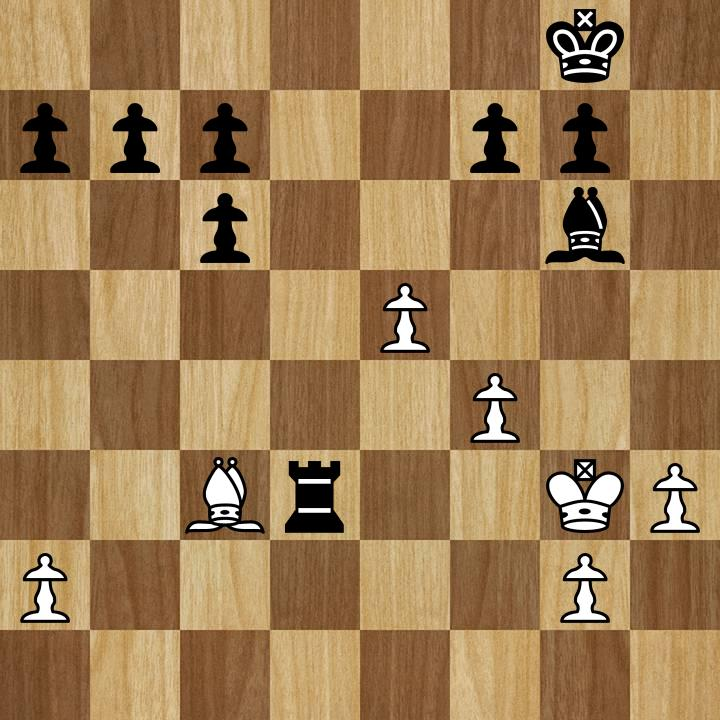

+++
title = "Chess Analysis #01: A Contrast of Man and Machine"
date =  2021-02-14
+++

This game the engine did not like at all, scoring me at 21.5% accuracy to my
opponent's 74.1%. Nevertheless I found it interesting as one of the more
tactics-heavy games I've played, and was surprised to see at a certain point
the engine actually thought the game in my favor despite me feeling pressed
up against the wall. Goes to show the difference between cold blooded machines
playing chess versus that of an emotional human.

<!-- more -->

Follow along with the PGN [here](/chess/01.pgn).

I went into the game with my usual plan to play into a Scotch, but the opponent
went for a Petrov's Defense with 2...Nf6 instead of 2...Nc6. The general plan
here is 3. Nxe5 expecting 3...d6 in which case the knight slides back to Nf3,
but my opponent instead played 3...Nc6, daring me to take and play into the
Stafford Gambit.

I've previously faced this position before and have generally declined, sliding
back to Nf3 anyways, but for fun I obliged and played 4. Nxc6. I confess I am
woefully unprepared at this point and it is on my to-do list to study up on the
Stafford to add to my repertoire, but further analysis of the Stafford ends here.

The game continues with standard development with 4...dxc6 5. Nc3 Bc5 6. h3 -
h3 or f3 is often played in the Scotch, or at least in my repertoire, whenever
the queen's bishop is on an open diagonal and there is a knight on the standard
f6 square, threatening to play on the annoying g4 square. In this game I played
h3 but later I would've wished I played f3 instead, defending the e4 pawn and
closing things off a bit to future intruders.

On move eight I then play 8. e5?, the beginning of the end. The engine really
does not like this, with the evaluation bar swinging from +2.85 to -0.60 here.
In fact I am beginning to realize pushing e5 probably is not a good idea in
the (Scotch) middlegame as earlier today I lost another game pushing e5, with
the engine similarly swinging the bar from +1.57 to -0.82. This is why you
analyze your games (and shows the marvel of learning chess in the age of
readily available neural network chess engines), hence this blog post.

In any case, 8. e5 and the troubles begin. My thinking at the time (in fact
both times) was to question the knight on c6, but the knight easily defends
and now there is a difficult to defend pawn sitting in the open. f4 is
possible but leaves your king's flank wide open, especially if black's
light squared bishop is still in play. d4 can defend if that pawn still
exists (it doesn't in a standard Scotch) but that pawn itself is hard to
defend, especially with the knight on c3 blocking a potential pawn on c3
to secure the pawn chain. My opponent, sensing this, immediately capitalizes
on my mistake with 8...Re8, pinning and attacking my hanging pawn. I
fruitlessly try to defend with 9. f3 but the doors are open now and the
attack begins - a demonstration of why the engine swings 3.45 points in my
opponent's favor. 9...Qd4!

At this point I realize I've gone from being on the attack to on the defense.
9...Qd4 infiltrates my position and with the bishop on c5, threatens mate
on the classic weak f2 square and similarly prevents castling (the folly
of a f4 defense). I try to defend, 10. Qe2, a poor attempt to defend f2 -
I was stubbornly unwilling to move my rook with the hopes of castling to
safety - fat chance with the enemy queen in my face.

This is where things really start getting fun and I start pressing my face
against my screen trying to calculate any possible exchanges and tactics
available to either of us. 10...Ng4?? a move the engine really does not
like, swinging the game back to +2.40 in my favor. But for me all I saw
was additional pressure on the f2 square.

My first reaction was to ask if I could take - after all I pushed h3 for
this exact reason. However I was afraid of 11. hxg4 Bxg4, attacking my
queen defending f2 and even if 12...Qf1 my king feels awfully cramped
with the newly arrived bishop staring down d1 and e2, the queen keeping
watch on f2, and my own queen blocking f1. But such is the folly of
man, for my king is actually quite safe in this position as there is no
follow-up and the engine confirming with +3.53 in my favor.

In any case after some thinking I found 11. Ne4!, at once adding another
defender to f2 and threatening to trade off the c5 bishop - when under
attack, start trading and try to stabilize. Proudly, for this one move,
this is actually the best move in the position.

11...Bf5?, the attack continues, questioning my newly placed knight.

Another emotional reaction, I panicked and tried to defend with 12. d3?,
but the move here was 12. hxg4. An interesting difference here compared with
a move ago. Here if 12...Bg4 not only does black lose a tempo having moved
his bishop twice, my queen can now move to d3 to challenge the black
queen. This is now possible because my knight defends the delicate f2 square,
whereas if I did this same maneuver while my knight was still on c3 then
...Qf2#. In an alternate universe where I didn't let my emotions get the
better of me the position would be stabilized and the game would've gone
on - the engine puts me at +5.53 with the above line.

But alas, 12. d3? opens the left king flank and the bishop punishes with
12...Bb4+. Again, the engine actually  considers me up here at +4.90, but it
certainly did not feel that way in the moment! 13. c3 is the move here which
I did consider! ... but incorrectly calculated 13...Bxc3 14. bxc3 Qxc3+,
forking my king and rook. Ah but my trusted knight on e4 also defends c3!
A completely missed calculation that led to my demise...and why board
visualization is important (as an aside I tend to follow the advice of Ben
Kingsley's [Bruce Pandolfini][brucePandolfini] "Don't move until you see it"
in the fantastic [Searching for Bobby Fischer][searchingForFischer]
when solving puzzles for this exact reason - being able to calculate without
physically moving a piece is an important skill in a real game).

With my inaccurate calculation I instead played the weaker 13. Bd2, then
immediately punished again by 13...Qxb2. The position is falling apart!
Yet again I am still up +2.82 somehow?? 14. Rd1 is the move here, sacrificing
the a pawn but preventing a disastrous Qxa1+ skewering my king and kingside
rook - blocking with my queen would work but at this point the opponent would
be happy to trade queens even at the cost of lightening the attack as they
would be a rook and a pawn up.

But stubbornly I did not want to lose my a pawn, fearing a queenside pawn
march so I played the disastrous 14. Qd1?? instead, hoping to defend the rook
on a1 as well as the hanging pawn on c2. And this fatal move closed the door
on my chances of any sort of counterplay, as seen after 14...Ne3 questioning
my newly moved queen, a move that would not have been possible if my queen
was still on e2 (here now the engine agrees with my fatalist attitude, putting
me at -6.40).

Not only is the knight attacking my queen here, but it also threatens Nxc2,
forking my king and rook. I saw this which only added to my already enhanced
sense of dread. I went for 15. Rb1 to counter-attack the queen, but
15...Nxd1 allows a recapture of the rook if 16. Rxb2 (which is what happened),
and if 16. Kxd1 then the original 17. Qxb1 is decisive. Here apparently 18. Ke2
is less bad than the more natural 18. Bc1, but at this point we're talking
the difference between -21.9 vs. -25.5.

The game ends in a few more moves with me losing a couple more pawns, being
forced into some trades, and finally a fork of my king and last remaining piece,
at which point I resigned.

Not my best game by any stretch, and one that I should have won had I not
miscalculated in a couple crucial moments. But that's why we analyze.
In the words of Grandmaster [Garry Kasparov][kasparov], "Find your mistakes,
next time you have to do better."

[brucePandolfini]: https://en.wikipedia.org/wiki/Bruce_Pandolfini
[kasparov]: https://en.wikipedia.org/wiki/Garry_Kasparov
[searchingForFischer]: https://en.wikipedia.org/wiki/Searching_for_Bobby_Fischer
