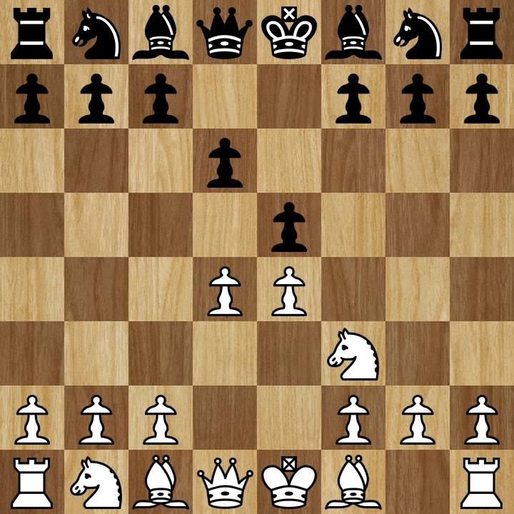
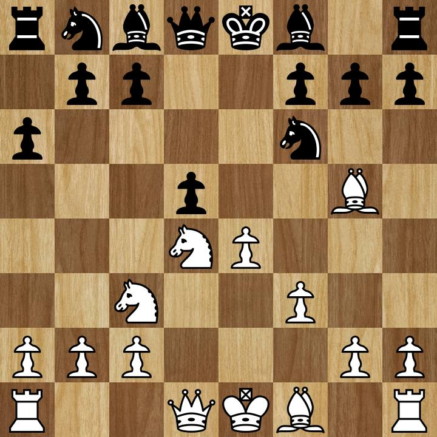
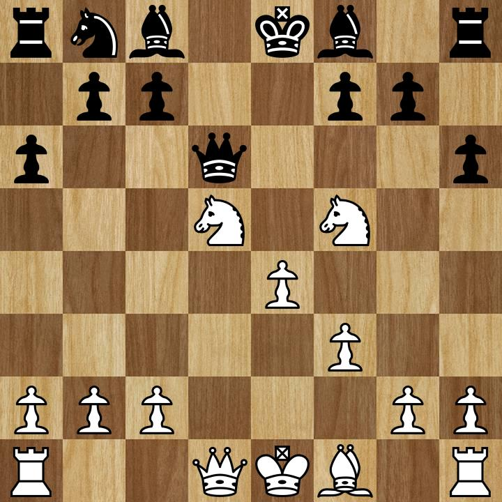
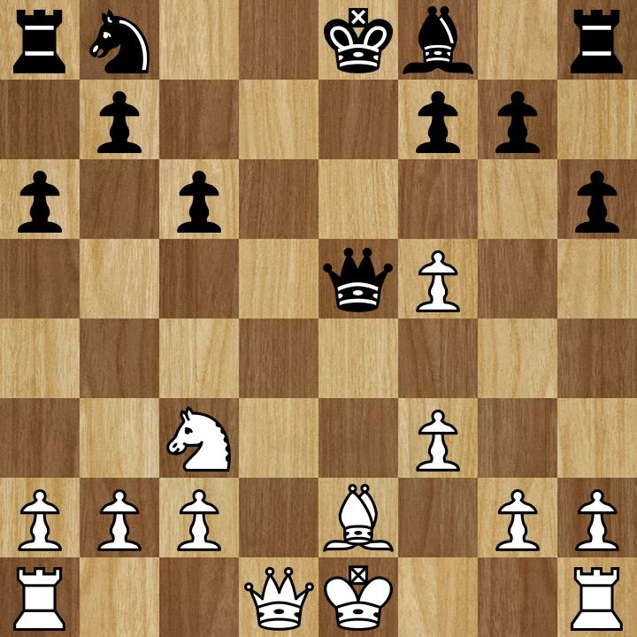
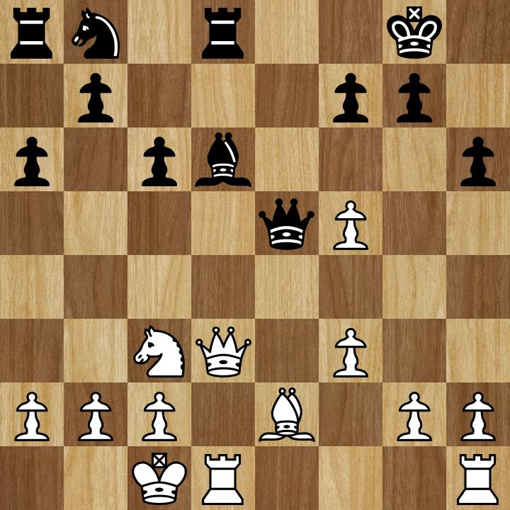
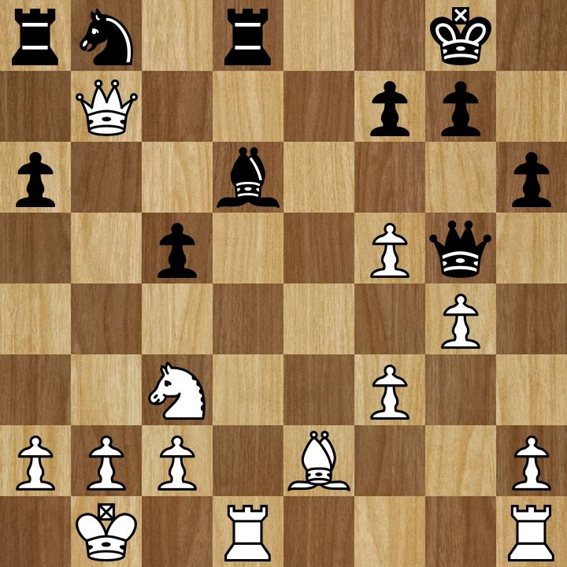
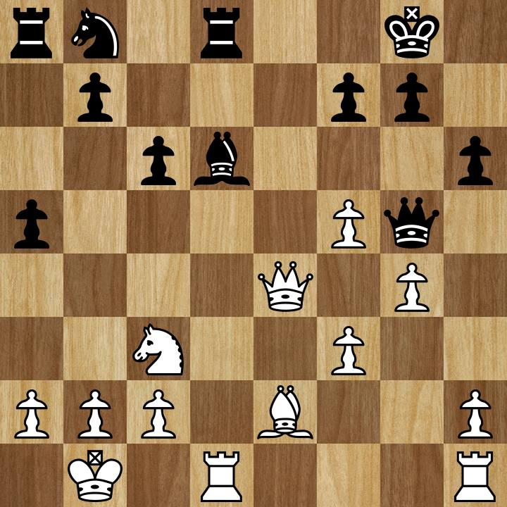
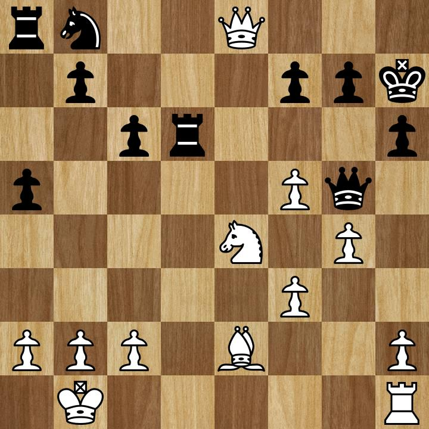
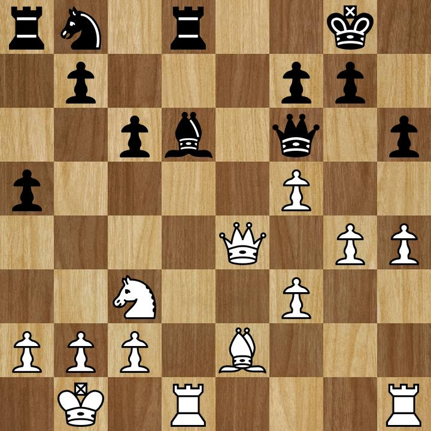
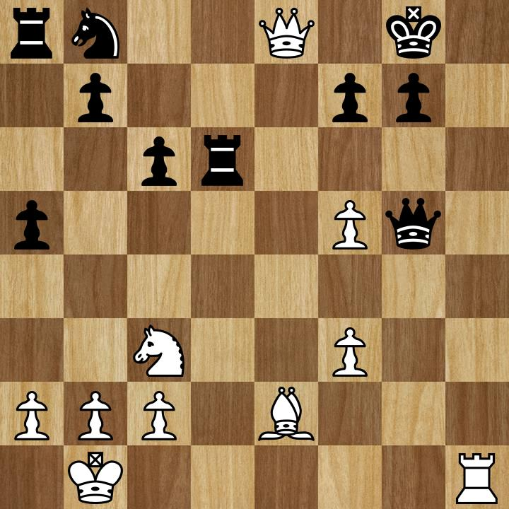

+++
title = "Chess Analysis #02: Seeing the line (and missing others)"
date =  2021-02-21
[taxonomies]
tags=["chess"]
+++

Often times in chess you will see a beautiful sequence of moves where you wish with all your
might that your opponent cooperatively follow it. This is one of the times where my opponent
did.

<!-- more -->

Follow along with the PGN [here](/chess/02.pgn).

Let's get right into it - 1. e4 e5 2. Nf3 d6 - a Philidor!

I've come prepared and carry on with my usual plan 3. d4 exd4 4. Nxd4 - Philidor Exchange Variation.
4...a6, guarding an invasion on b5. No matter, that was never my intention anyways. 5. Nc3 Nf6
and I make a similar prophylactic move 6. f3, adding protection to the e4 pawn and preventing
an intrusion on g4. 6...d5 to open up their dark squared bishop and I lash out with 7. Bg5,
pinning the knight.

My opponent doesn't like this and follows with 7...h6 to question my bishop's intensions. Here
I decided to trade, with the idea being if 8...gxf6 then they've ruined their kingside pawn
structure along with any hopes of castling kingside, or 8...Qxf6 in which case 9. Nxd5 winning
a free pawn and attacking the queen, winning a tempo. The opponent chose the latter option and
moved their queen to the safety of d6.

I respond with 10. Nf5 with the idea of attacking the queen again and start intruding on
my opponent's space.

However what I did not see was after 10...Bxf5 11. exf5 there is 11...Qe5+ and my king is looking
quite vulnerable. Instead of sacrificing castling rights I block with my bishop 12. Be2, but
the engine doesn't like this - from what I can tell it would rather I meet the threat up front
and dare a trade as opposed to volunteering the bishop for a pin. I tend to prefer holding onto
my queen unless I see some form of compensation in a queen trade, but I'm by no means a highly
rated player so what do I know?

12...c6 kicking my knight back to 13. Nc3 - my opponent could not 12...Qxf5 because then
13. Nc7+, forking the king and rook.

13...Bd6 a developing move and enabling short castles, though the engine prefers 13...Nd7 here
enabling long castles and bringing the rook onto the open d-file. I was on the same page as the engine
here with 14. Qd3 O-O 15. O-O-O and I have a lethally stacked queen and rook on the open d-file.
15...Rd6 to defend the bishop and we got ourselves a standoff in the center of the board.

Fearing a discovered attack on my queen and not feeling super confident in my position (though
the engine puts me at +2.26 here) I offer a queen trade with 16. Qe4??. The engine *really*
doesn't like this and considers it a blunder, though following the line the engine sees I
feel "blunder" is a bit strong of a phrase as no material is lost and I end up +1.05 after
the sequence.

My opponent is not interested in this and retreats their queen to 16...Qf6. Noting my opponent's
undeveloped queenside, a vulnerable looking king, and the opposite side castled position,
I begin a kingside pawn storm with 17. g4. My opponent unafraid follows with 17...Qg5+, and
I retreat my king to the safety of 18. Kb1.

At this point my opponent too realizes his queenside pieces are sleeping but unfortunately for
the knight the usual c6 square is occupied, as is a6. 18...Nd7 is not possible because it
cuts off vision of the rook on the bishop and subsequently loses it. 18...c5 to open up c6
is also not possible because of 19. Qxb7 and either the rook, the knight, or the bishop
are in trouble. This is a fun variant so I'll show it below.

If the knight doesn't move, my queen will take the rook. If the knight moves to d7 the bishop
hangs, as before. If the knight moves to c6 (what the engine considers to be the.. least
terrible) then the queen will take the knight for free.

So instead my opponent plays 19. a5? with the idea to develop the knight via a6. But here
the engine sees a line I missed, which I'll reproduce from the below starting position.

The line goes 19. Rxd6 - a seemingly bizarre move to trade a rook for a bishop. Black must
respond or risk losing a bishop for free, 19...Rxd6. But now the rook has left its post
and we can go 20. Qe8+!. King of course escapes to safety with 20...Kh7 and now the reason
we "sacrificed" the rook - the e4 square, which used to be occupied by the queen, can
now be occupied by the knight, thus forking the queen and rook and even if the queen goes to
d8 to protect the rook and attack my queen, the knight will take the rook all the same,
protecting its queen and black's only response is Qxd6 leaving us a pawn ahead, a queen
invaded, and an enemy king one check away from mate.

This unfortunately did not happen.. but I made up for it a couple moves later actually,
utilizing a very similar idea. 19. h4, the pawn storm continues, and attacks the queen
winning a tempo. Here my opponent had a chance to quickly stabilize with 19...Qe7 and
trading queens, but probably like me they were attached to their queen. Instead they played
19...Qf6?! and here is where I saw the line that made me choose this game to analyze
this week.

It starts with 20. g5 and here my opponent has one last chance to play Qe7 to prevent
total chaos. But I think my opponent saw what I saw, which is after 20...hxg5 21. hxg5
Qxg5 they are just up a pawn. Which is true. But I have quite good compensation for
this lost pawn: my rook is now staring down the open h-file, cutting off the enemy
king's escape, and the enemy queen has left the defense of the bishop on d6.

From here one of two things will happen - I will win the bishop for free after 22. Rxd6,
or black will be checkmated, for after 22...Rxd6, 23. Qe8# wins the game. The move after 22. Rxd6
is at best 22...Nd7, protecting the d8 rook and connecting both rooks. But even
after this there is the savage 23. Rg6 and black cannot take with 23...fxg6 because
that will lead to 24. Bc4+ Kf8 25. Rh8#. Actually black can stay alive a bit longer
here with 23...Qd2, the only safe square for the queen, but the black king is in
quite a precarious position.

In any case, after 22. Rxd6 my opponent not sensing danger thought for two seconds,
took my rook, and lost the game.

